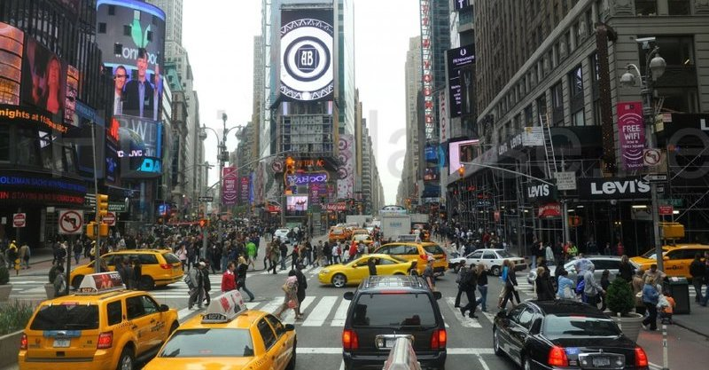
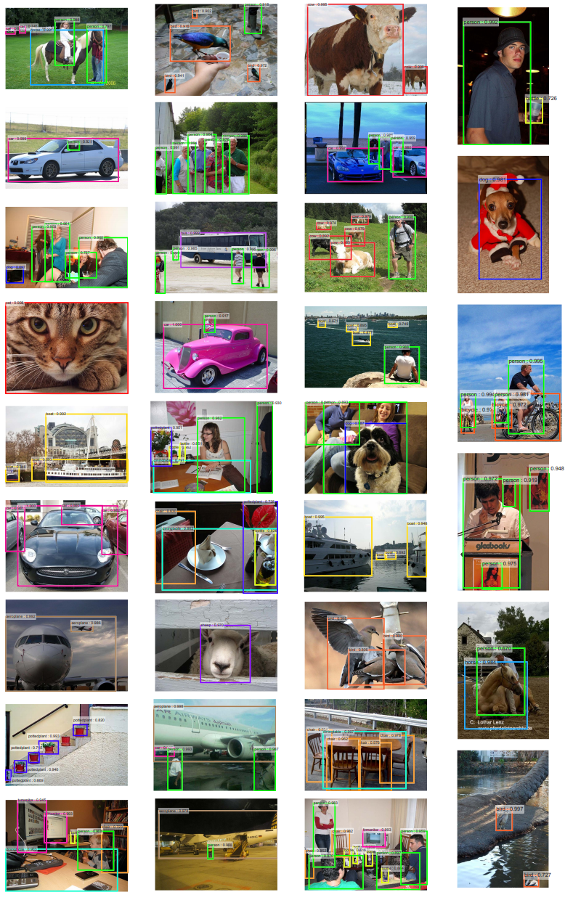
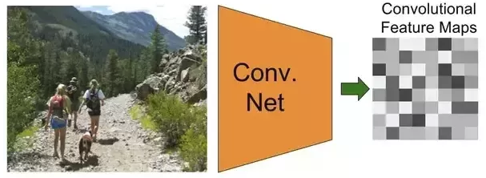
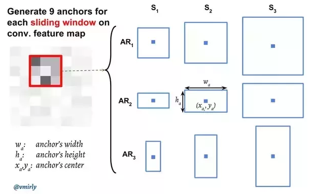
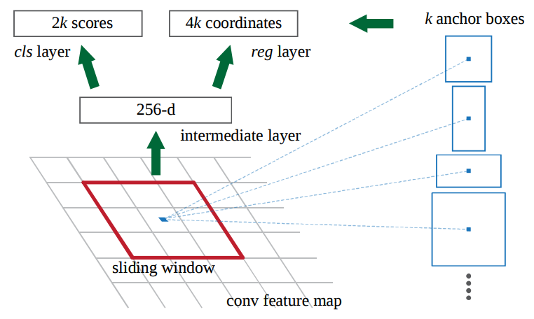

[TOC]

# What is Faster R-CNN

Deep learning에 처음 들어온 사람들은 보통 MNIST 데이터를 갖고서 딥러닝으로 손글씨를 인식하는 모델을 만듭니다. 하지만 실제 인간이 접하는 비젼의 문제는 이것보다 훨씬 까다롭습니다.  아래 사진은 뉴욕의 사진입니다. 엄청나게 많은 사람들, 차량, 광고, 건물, 신호등 등등 엄청나게 복잡한 사물들로 이루어져 있습니다. 



인간은 이 복잡한 그림 속에서 대부분을 모두 구분 할 수 있으며, 심지어 겹쳐있는 사물들도 알 수 있고, 사물과 사물의 관계또한 알 수 있습니다. 인공지능이 사물과 사물들을 구분해내고 분류할 수 있을까요? Faster R-CNN을 사용하면 이미지속의 여러 사물을 한꺼번에 분류해 내놓으며, 데이터 학습에 따라서 겹쳐 있는 부분들 까지도 정확하게 사물들을 분류해낼 수 있습니다.




> 여러가지 알고리즘들이 있습니다. R-CNN, Fast R-CNN, Faster R-CNN, Mask R-CNN, YOLO, YOLO v2 등등.. 
> 최초가 된 분석 방법은 R-CNN이고, selective search의 단점을 보완한게 Fast R-CNN이고, 여기서 다시 보완한게 Faster R-CNN입니다. YOLO의 경우 속도가 Faster R-CNN보다 훨씬 빠릅니다만 예측률이 떨어집니다. YOLO가 초당 50장정도 처리 가능하다고 하면, Faster R-CNN의 경우 5~7장정도밖에 처리를 하지 못합니다. Faster R-CNN과 YOLO의 차이는 예측률과 속도 사이의 trade off를 선택하는 것 입니다.


# Architecture

## Introduction

Faster R-CNN은 두개의 네트워크로 구성이 되어 있습니다. 

 - Deep Convolution Network로서 Region Proposal Network (RPN) 이라고 함
 - Fast R-CNN Detector로서 앞의 proposed regions을 사용하여 object를 감지함


Faster R-CNN안에는 2개의 모듈이 존재하지만, 전체적으로는 하나의 object detection network라고 볼 수 있습니다.
이게 중요한 이유는 Fater R-CNN이후부터 **fully differentiable model**이기 때문입니다.


가장 상위단서부터 큰 그림을 그리면서 세부적인 부분을 설명하도록 하겠습니다. 

## Input Images 

Input images는 **Height x Width x Depth** 를 갖고 있는 tensors입니다. 
쉽게 말해 그냥 RGB컬러를 갖고 있는 이미지입니다. 

## Base Network (Shared Network)

### Name Meaning

일단 이름의 의미부터 보도록 하겠습니다. 
이전 R-CNN에서는 Region proposal을 하기 위해서 selective search를 사용했습니다.  
Selective search를 통해서 나온 수천개 각각의 region proposals마다 CNN(AlexNet)을 사용하여 forward pass를 하였습니다. 또한 3개의 모델(feature를 뽑아내는 CNN, 어떤 class인지 알아내는 classifier, bounding boxes를 예측하는 regression model)을 각각 학습시켜야 했습니다.

Fast R-CNN에서는 중복되는 연산을 하나의 CNN 으로 해결을 해버립니다. 
즉 이미지를 가장 먼저 받아서 feature를 뽑아내는 일을 하기 때문에 base network 또는 중복되는 일을 하나의 CNN에서 처리하기 때문에 shared network라고 하는 것 입니다. 자세한 내용은 [CNN 히스토리](https://blog.athelas.com/a-brief-history-of-cnns-in-image-segmentation-from-r-cnn-to-mask-r-cnn-34ea83205de4?token=8y0wRhgrjcR2Zl9z) 또는 [Fast R-CNN과 Faster R-CNN의 비교](https://jhui.github.io/2017/03/15/Fast-R-CNN-and-Faster-R-CNN/)를 참고합니다.


### How it works

Base network 가 하는 일은 이미지에 대한 features extraction입니다. 
중요한 포인트는 사실 **이미 학습이 되어 있는 모델(pre-trained model)**을 사용해야 한다는 것 입니다. (즉 transfer learning과 유사하며 CNN의 특징을 알고 있다면 왜 이렇게 하는지 이해가 될 겁니다.)

모델은 기존의 모델을 주로 사용합니다. 
ResNet, VGG, Google의 Inception등등 다양하게 사용할 수 있습니다. 다만 찾고자 하는 object의 feature를 뽑아내야 하기 때문에 이미 해당 object를 학습해 놓은 상태여야 합니다. 아래와 같이 이미지를 input값으로 받아서 CNN모델에 들어가게 되면 output으로 찾고자 하는 object의 feature maps 을 얻을 수 있습니다.




## Region Proposal Networks

Region Proposal Network (RPN)은 convolution을 사용하여 구현이 되며, input 값은 이전 base network에서 뽑아낸 feature maps을 사용합니다.  Region proposals을 생성하기 위해서는 base network에서 생성한 feature maps위에 n x n spatial window (보통 3 x 3)를 슬라이드 시킵니다.  각각의 sliding-window가 찍은 지점마다, 한번에 여러개의 region proposals을 예측하게 됩니다. Region proposals의 최고 갯수는 $ k $ 로 나타내며, 이것을 **Anchor** 라고 부릅니다. 보통 각 sliding window의 지점마다 9개의 anchors가 존재하며 , 3개의 서로 다른 종횡비 (aspect ratios) 그리고 3개의 서로 다른 크기(scales) 가 조합되며 모두 동일한 중앙 지점 $ (x_a, y_a) $ 을 갖고 있습니다.




Sliding window를 통해서 나온 feature map의 depth는 더 낮은 차원이 됩니다. (예. 512 depth --> 256 depth) 이후의 output값은 1 x 1 kernel을 갖고 있는 두개의 convolutional layers로 양분되어 들어가게 됩니다.  

**Classification layer**에서는 anchor당 2개의 predictions값을 내놓으며, 객체인지 아니면 객체가 아닌지(그냥 배경인지)에 관한 확률값입니다.

**Regression layer** (또는 bounding box adjustment layer)는 각 anchor당 델타값들 $ \Delta_{x_{\text{center}}} $, $ \Delta_{y_{\text{center}}} $,  $ \Delta_{\text{width}} $, $ \Delta_{\text{height}} $  4개의 값을 내놓습니다. 이 델타 값들은 anchors에 적용이 되어서 최종 proposals을 얻게 됩니다. 


```


## Classifier of Background and Foreground 

**Classifier**를 학습시키기 위한 training data는 바로 위의 **RPN으로 부터 얻은 anchors** 와 **ground-truth boxes** (실제 사람이 집접 박스 처리한 데이터) 입니다. 

모든 anchors를 foreground 이냐 또는 background이냐로 분류를 해야 합니다. 
분류를 하는 기준은 어떤 anchor가 ground-truth box와 오버랩 (중복되는 면적)되는 부분이 크면 foreground이고, 적으면 background입니다. 각각의 anchor마다 foreground인지 아니면 background인지 구별하는 값을  $ p^* $ 값이라고 했을때 구체적인 공식은 다음과 같습니다. 


$$ \begin{equation} p^* = \begin{cases} 1 & \text{if } IoU \gt 0.7 \\ -1 & \text{if } IoU \lt 0.3 \\ 0 & \text{if otherwise}  \end{cases}  \end{equation} $$


여기서 IoU는 Intersection over Union으로서 다음과 같이 정의가 됩니다. 
자세한 내용은 [여기](https://www.pyimagesearch.com/2016/11/07/intersection-over-union-iou-for-object-detection/) 를 참고 합니다. 


$$ \begin{equation} IoU = \frac{\text{anchor } \cap \text{ ground-truth box}}{\text{anchor } \cup \text{ ground-truth box}} \end{equation} $$


일반적으로 IoU값이 가장 높은 값을 1값으로 잡으면 되지만.. 정말 레어한 케이스에서 잘 잡히지 않는 경우 0.7이상으로 해서 잡으면 됩니다. 또한 하나의 ground-truth box는 여러개의 anchors에 anchors에 1값을 줄 수 가 있습니다.  또한 0.3 이하의 값으로 떨어지는 anchor는 -1값을 줍니다. 그외 IoU 값이 높지도 정확하게 낮지도 않은 anchors들 같은 경우는 학습시 사용되지 않는... 그냥 아무취급도 안하면 됩니다. (태스크에 따라서 0.7이상이냐 0.3이하냐는 언제든지 바뀔 수 있습니다.)


**Binary classification**을 학습시 문제는 어떻게 ground-truth boxes (실제 사물이 들어있는 박스 영역)를 이용하여 각각의 anchor에 레이블링 시키는가 입니다. 

